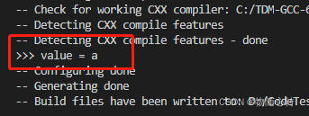
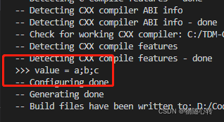
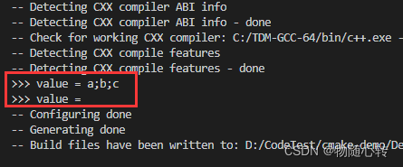

# Steps补充
对于官方课程未涉及到或者没有理解的知识点进行补充

## Step1
### set命令

set命令可以设置普通变量、缓存条目、环境变量三种变量的值，分别对应以下三种命令格式。set的值`<value>...`表示可以给变量设置0个或者多个值，当设置多个值时（大于2个），多个值会通过分号连接符连接成一个真实的值赋值给变量，当设置0个值时，实际上是把变量变为未设置状态，相当于调用unset命令。

```cmake
set(<variable> <value>... [PARENT_SCOPE]) #设置普通变量
 
set(<variable> <value>... CACHE <type> <docstring> [FORCE]) #设置缓存条目
 
set(ENV{<variable>} [<value>]) #设置环境变量
```

打印输出：



设置变量为多个给定的值

```cmake
cmake_minimum_required (VERSION 3.10.2)
 
project (set_test)
 
set (normal_var a b c)
 
message (">>> value = ${normal_var}")
```
打印输出：



设置变量为空

```cmake
cmake_minimum_required (VERSION 3.10.2)
 
project (set_test)
 
set (normal_var a b c)
 
message (">>> value = ${normal_var}")
 
set (normal_var) # 设置变量为空
 
message (">>> value = ${normal_var}")
```

打印输出：



太多了！！！直接参考[cmake命令之set](https://blog.csdn.net/sinat_31608641/article/details/123101969)