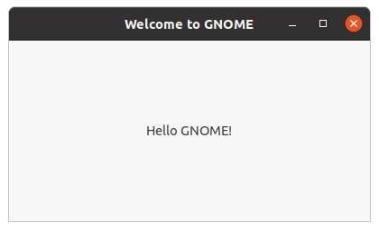

# 二、Tutorial

这个页面从头开始演示了如何为一个简单项目创建一个Meson构建定义，然后扩展到使用外部依赖项，以展示如何轻松地将它们集成到您的项目中。

这个教程主要是针对Linux使用的。它假设您的系统上已经安装了GTK开发库。在基于Debian的系统（如Ubuntu）上，您可以使用以下命令来安装它们：

```bash
sudo apt install libgtk-3-dev -y
```

在其他平台（如Windows和macOS）上也可以构建GUI应用程序，但您需要安装所需的依赖项。

## 1 The humble beginning

让我们从最基本的程序开始，即经典的 hello 示例。首先，我们创建一个名为 main.c 的文件，其中包含源代码。它看起来像这样：

```c
#include <stdio.h>

//
// main is where all program execution starts
//
int main(int argc, char **argv) {
  printf("Hello there.\n");
  return 0;
}
```

然后，我们创建一个 Meson 构建描述，并将其放入同一目录中名为 meson.build 的文件中。其内容如下：

```meson
project('tutorial', 'c')
executable('demo', 'main.c')
```

就是这些。请注意，与 Autotools 不同，您无需将任何源头文件添加到源列表中。

现在，我们已准备好构建我们的应用程序。首先，我们需要通过进入源目录并执行以下命令来初始化构建：

```bash
meson setup builddir
```

我们创建一个单独的构建目录来保存所有编译输出。与其他一些构建系统不同，Meson 不允许在源目录内进行构建。您必须始终创建一个单独的构建目录。通常的约定是将默认的构建目录放在顶层源目录的子目录中。

当运行 Meson 时，它会打印以下输出。

```bash
The Meson build system
Version: 1.2.2
Source dir: /home/lieryang/Desktop/build-system/meson_study/02_Tutorial
Build dir: /home/lieryang/Desktop/build-system/meson_study/02_Tutorial/builddir
Build type: native build
Project name: tutorial
Project version: undefined
C compiler for the host machine: cc (gcc 9.4.0 "cc (Ubuntu 9.4.0-1ubuntu1~20.04.2) 9.4.0")
C linker for the host machine: cc ld.bfd 2.34
Host machine cpu family: x86_64
Host machine cpu: x86_64
Build targets in project: 1
```

现在，我们准备去编译我们的代码

```bash
cd builddir
ninja
```

如果您的 Meson 版本更新于 0.55.0，您可以使用新的与后端无关的构建命令：

```bash
$ cd builddir
$ meson compile
```

在本文的其余部分，我们将使用后一种形式。

一旦可执行文件构建完成，就可以运行它。

```bash
./demo
```

这会生成预期的输出。

```bash
Hello there.
```

## 2 Adding dependencies

只是打印文本有点过时。让我们更新我们的程序，创建一个图形窗口。我们将使用GTK+窗口工具包。首先，我们编辑主文件以使用GTK+。新版本如下所示。

```c
#include <gtk/gtk.h>

//
// Should provided the active view for a GTK application
//
static void activate(GtkApplication* app, gpointer user_data)
{
  GtkWidget *window;
  GtkWidget *label;

  window = gtk_application_window_new (app);
  label = gtk_label_new("Hello GNOME!");
  gtk_container_add (GTK_CONTAINER (window), label);
  gtk_window_set_title(GTK_WINDOW (window), "Welcome to GNOME");
  gtk_window_set_default_size(GTK_WINDOW (window), 400, 200);
  gtk_widget_show_all(window);
} // end of function activate

//
// main is where all program execution starts
//
int main(int argc, char **argv)
{
  GtkApplication *app;
  int status;

  app = gtk_application_new(NULL, G_APPLICATION_DEFAULT_FLAGS);
  g_signal_connect(app, "activate", G_CALLBACK(activate), NULL);
  status = g_application_run(G_APPLICATION(app), argc, argv);
  g_object_unref(app);

  return status;
} // end of function main
```

然后，我们编辑Meson文件，指示它查找并使用GTK+库。

```meson
project('tutorial', 'c')
gtkdep = dependency('gtk+-3.0')
executable('demo', 'main.c', dependencies : gtkdep)
```

如果你的应用程序需要使用多个库，你需要为每个库使用单独的dependency()调用，就像这样：

```meson
gtkdeps = [dependency('gtk+-3.0'), dependency('gtksourceview-3.0')]
```

我们不需要它来完成当前的示例。

现在，我们已经准备好构建。需要注意的是，我们不需要重新创建构建目录、运行任何神奇的命令或类似的东西。相反，我们只需键入与重建代码相同的命令，而不进行任何构建系统更改。

```bash
meson compile
```

这创建了以下GUI应用程序。



## 参考
[翻译自：Meson Tutorial](https://mesonbuild.com/Tutorial.html#tutorial)